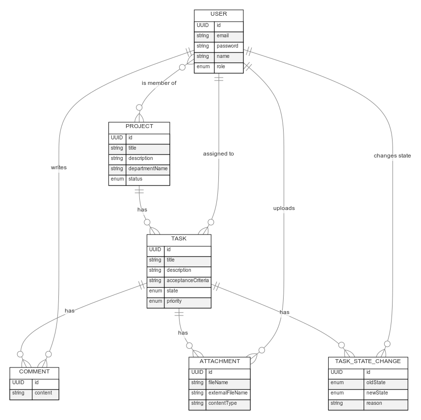
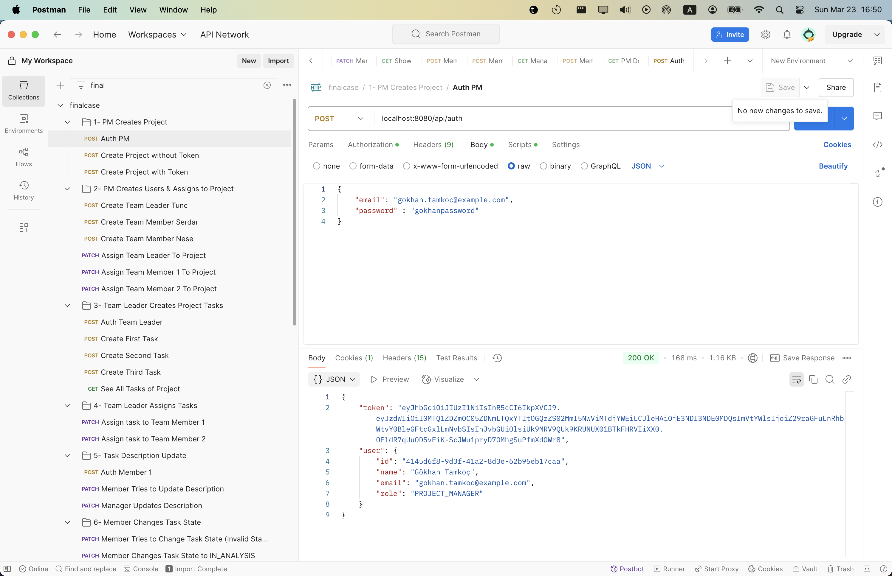
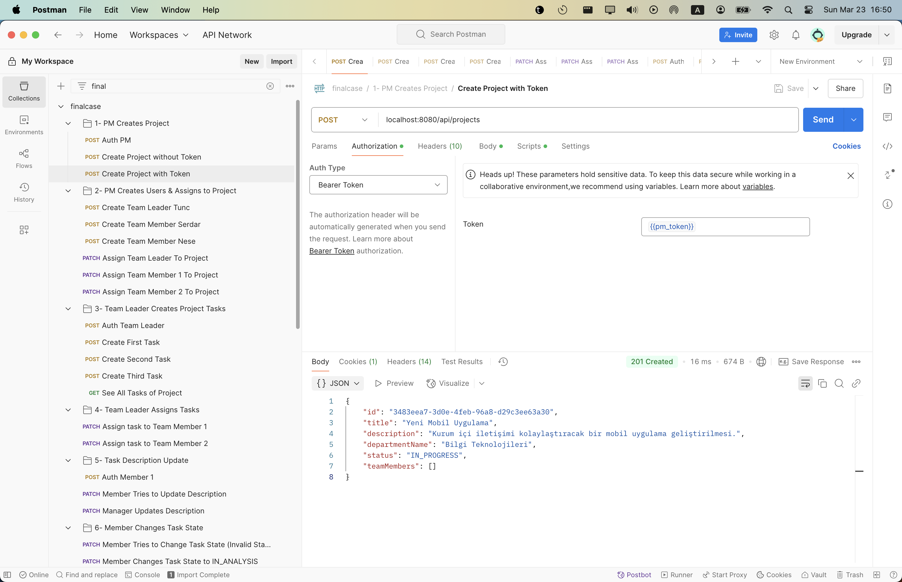
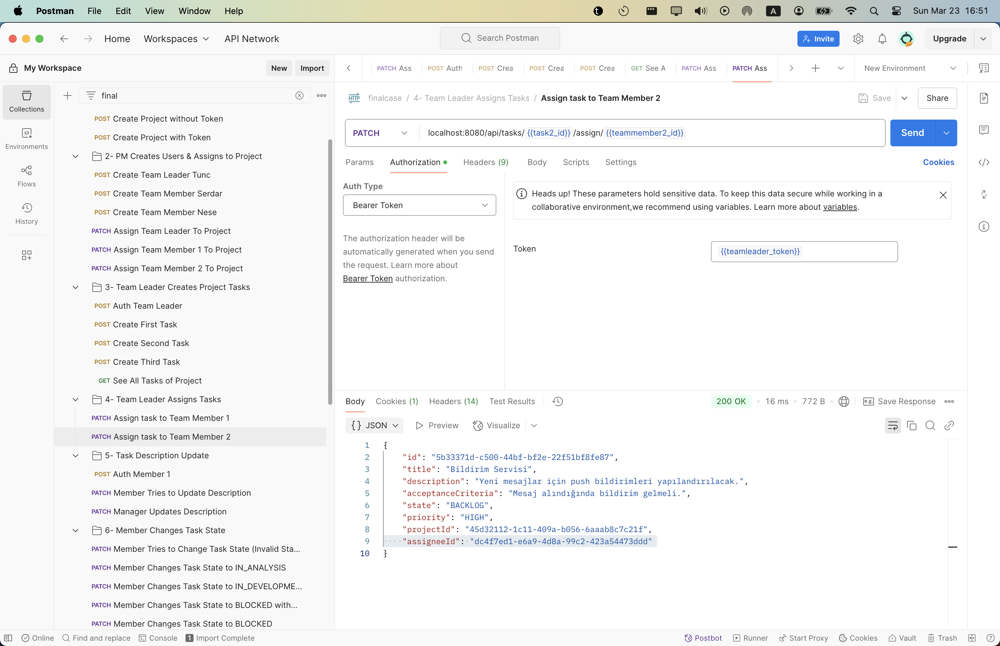
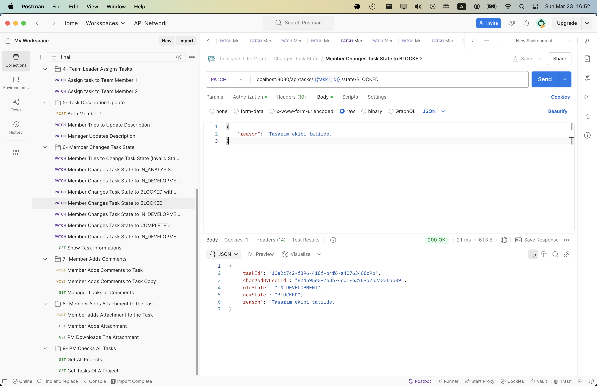

# finalcase

DefineX Java Spring Bootcamp Final Case 

A role-based task and project management backend built with Spring Boot, featuring secure JWT authentication, task workflows, file attachments via MinIO, and MySQL persistence.

---

## Data Models
The application uses a relational data model with the following core entities:

- **User**
    - Fields: `id`, `email`, `password`, `name`, `role`
    - Relationships:
        - Many-to-Many with `Project`
        - One-to-Many with `Comment`, `Attachment`, `TaskStateChange`

- **Project**
    - Fields: `id`, `title`, `description`, `departmentName`, `status`
    - Relationships:
        - Many-to-Many with `User`
        - One-to-Many with `Task`

- **Task**
    - Fields: `id`, `title`, `description`, `acceptanceCriteria`, `state`, `priority`
    - Relationships:
        - Many-to-One with `Project`
        - Many-to-One with `User` (assignee)
        - One-to-Many with `Comment`, `Attachment`, `TaskStateChange`

- **Comment**
    - Belongs to a `Task` and a `User`

- **Attachment**
    - Belongs to a `Task` and a `User`
    - Stores metadata and MinIO object references

- **TaskStateChange**
    - Tracks transitions in a task's state
    - Requires `reason` for certain transitions (`CANCELLED`, `BLOCKED`)

---



## Services Used

###  MySQL
- Stores all entity data including users, tasks, projects, and comments.
- Integrated using Spring Data JPA and Hibernate.
- Versioned and timestamped entities with auditing support (`@EnableJpaAuditing`).

### MinIO
- Used for storing file attachments related to tasks.
- Each file is uploaded with a unique filename and metadata.
- Interaction is handled using the official `MinioClient`.
- Bucket is auto-created if it doesn't exist at startup.

---


## Security Structure

###  Authentication
- Implemented using **JWT tokens**.
- `access_token`: sent via `Authorization` header (Bearer token).
- `refresh_token`: stored in a secure, HTTP-only cookie.
- On login, both tokens are issued. Access token expires in 1 hour, refresh in 1 day.

###  Token Handling
- `JwtService`: responsible for issuing and verifying tokens.
- Custom Spring Security filter (`JwtAuthenticationFilter`) reads token from header or cookie and authenticates the user.
- `UserPrincipalAuthToken` wraps authenticated user.

###  Authorization
- Role-based access using custom annotations:
    - `@PublicEndpoint` → No authentication required
    - `@AnyTeamRole` → `PROJECT_MANAGER`, `TEAM_LEADER`, `TEAM_MEMBER`
    - `@ManagerOrLeaderRole` → `PROJECT_MANAGER`, `TEAM_LEADER`
    - `@ProjectManagerRole` → `PROJECT_MANAGER` only
    - `@RefreshPermit` → Only refresh token can access


## API Endpoints

| Method | Endpoint | Description | Request Body | Role |
|--------|----------|-------------|--------------|------|
| `POST` | `/api/auth` | Login and get access token | `LoginRequest` | Public |
| `GET` | `/api/auth/refresh` | Refresh access token using cookie | — | Refresh token |
| `GET` | `/api/auth/logout` | Clear refresh cookie | — | Any Team Role |
| `POST` | `/api/users` | Create a new user | `UserRequest` | Project Manager |
| `PATCH` | `/api/users/{id}/role/{role}` | Update user role | — | Project Manager |
| `PATCH` | `/api/users` | Update self | `UserUpdateRequest` | Any Team Role |
| `GET` | `/api/users/{id}` | Get user by ID | — | Any Team Role |
| `GET` | `/api/users` | List all users | — | Project Manager |
| `POST` | `/api/projects` | Create project | `ProjectRequest` | Project Manager |
| `PATCH` | `/api/projects/{id}` | Update project | `ProjectRequest` | Project Manager |
| `DELETE` | `/api/projects/{id}` | Delete project | — | Project Manager |
| `PATCH` | `/api/projects/{id}/assign/{userId}` | Assign user to project | — | Project Manager |
| `PATCH` | `/api/projects/{id}/remove/{userId}` | Remove user from project | — | Project Manager |
| `GET` | `/api/projects` | List all projects | — | Any Team Role |
| `GET` | `/api/projects/{id}` | Get project by ID | — | Any Team Role |
| `GET` | `/api/projects/{id}/team` | Get team members | — | Any Team Role |
| `POST` | `/api/tasks/{projectId}` | Create task | `TaskRequest` | Project Manager, Team Leader |
| `GET` | `/api/tasks/{taskId}` | Get task by ID | — | Any Team Role |
| `GET` | `/api/tasks/project/{projectId}` | List tasks in project | — | Any Team Role |
| `PATCH` | `/api/tasks/{taskId}/state/{newState}` | Change task state | `ReasonRequest` (if required) | Any Team Role |
| `PATCH` | `/api/tasks/{taskId}/assign/{userId}` | Assign task | — | Project Manager, Team Leader |
| `PATCH` | `/api/tasks/{taskId}/priority/{priority}` | Update task priority | — | Project Manager, Team Leader |
| `PATCH` | `/api/tasks/{taskId}/description` | Update task description | `TaskDescriptionRequest` | Project Manager, Team Leader |
| `POST` | `/api/tasks/{taskId}/comments` | Add comment | `CommentRequest` | Any Team Role |
| `GET` | `/api/tasks/{taskId}/comments` | Get all comments | — | Any Team Role |
| `PATCH` | `/api/tasks/{taskId}/comments/{commentId}` | Update comment | `CommentRequest` | Author only |
| `DELETE` | `/api/tasks/{taskId}/comments/{commentId}` | Delete comment | — | Author only |
| `POST` | `/api/tasks/{taskId}/attachments` | Upload file | `multipart/form-data` | Any Team Role |
| `GET` | `/api/tasks/{taskId}/attachments` | List attachments | — | Any Team Role |
| `GET` | `/api/tasks/attachments/{attachmentId}` | Download file | — | Any Team Role |
| `DELETE` | `/api/tasks/{taskId}/attachments/{attachmentId}` | Delete attachment | — | Any Team Role |

---

## Installation & Running

### Prerequisites

- Docker installed

---
#### Clone the repository
```bash
git clone https://github.com/enverygltr/finalcase.git
cd finalcase
```
Start the application using Docker Compose
```bash
docker compose up --build
```
##  Test the API using Postman Collection

Use the provided Postman Collection to try out the API.

1. **Import** the collection into Postman.
2. **Execute** the requests in the given order.
3. For endpoints that require file uploads, use **form-data** with a key named `file` for the attachment input.

##  Screenshots





